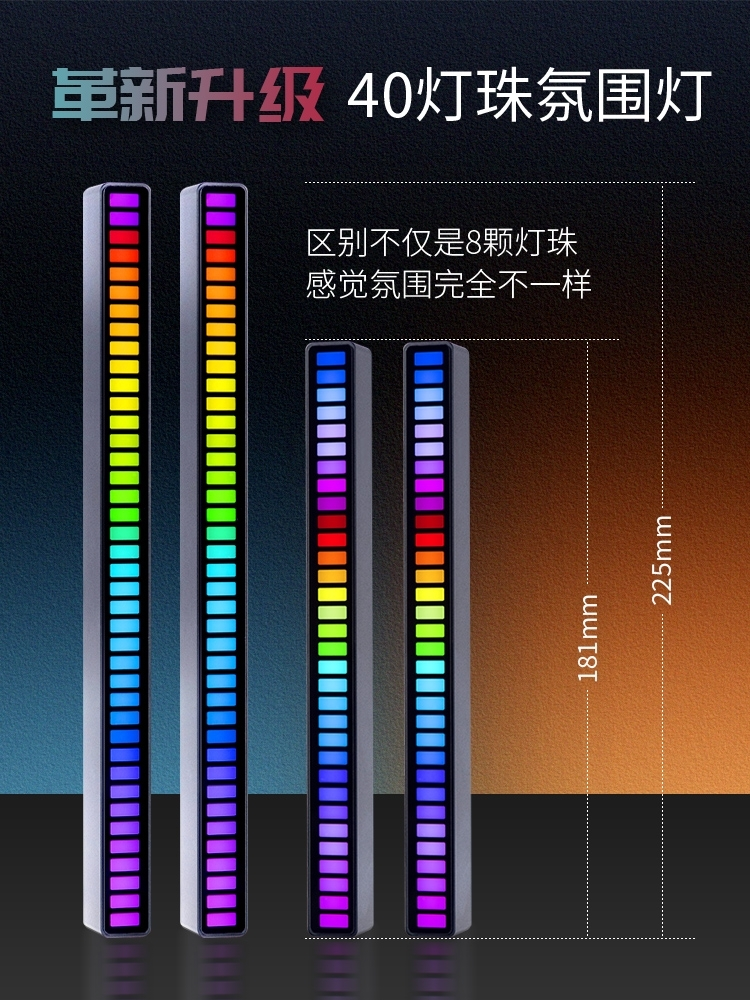

# MusicColorful
music colorful,make life and work colorful.

## 介绍

音乐，我想让它可视化，普通音乐播放器还都没有实现，大致就是像下图那样，但是我想渲染的更顺滑，这样会更有气氛。

     
    
     

## 实现原理

1. 采集麦克风或者声卡音乐进行能量量化。
2. 在显示器两侧创建两个透明窗口，渲染步骤1中采集到的能量。
3. 为 audio level 添加伪彩。

## 功能需求

1. Music基础可视化；
2. 色彩方案可选；
3. 整体透明度可调，渲染宽度可调；
4. 增加更多模式，例如边框模式、全屏模式（沉浸式放空）；
5. 多屏适配；
6. 快捷键支持（随时切换）；
7. 跨平台（Win、Mac）；

## TODO

开始码代码，拾音肯定是用WebRTC，渲染准备用SDL2，用户交互计划使用WebUI + Local HttpServer，期待~。